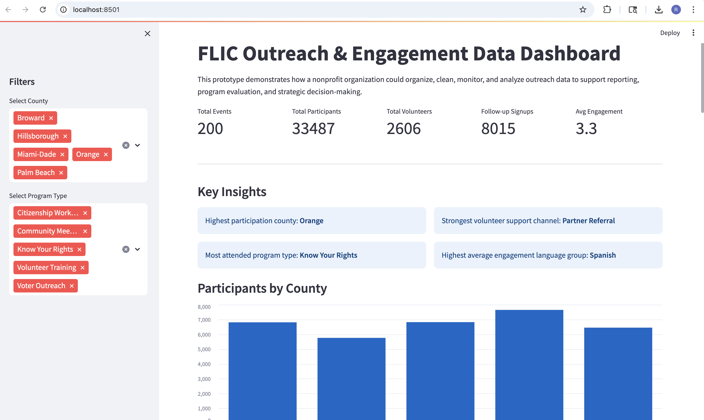
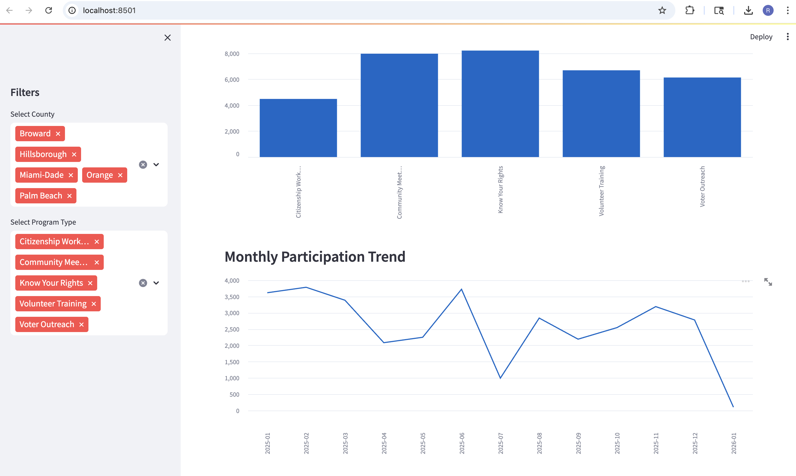
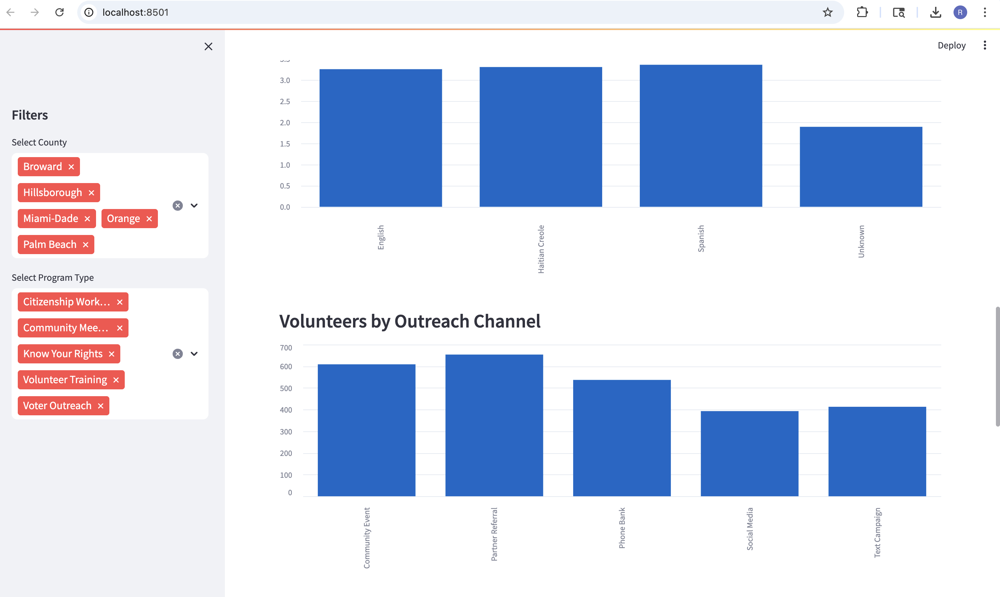
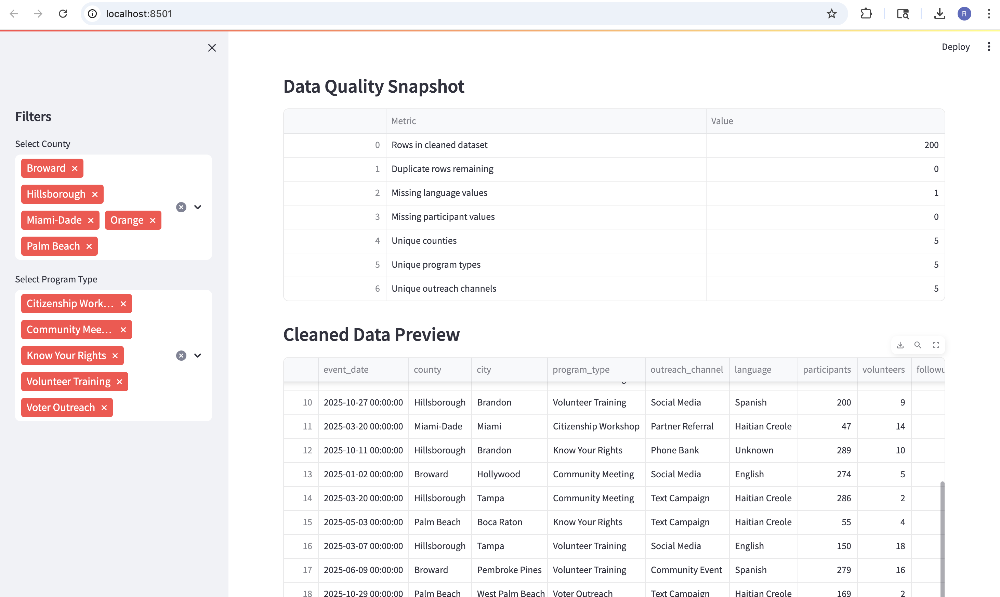

# FLIC Outreach & Engagement Analytics Dashboard

This project demonstrates a prototype analytics system for nonprofit outreach and organizing programs.

The goal is to illustrate how campaign engagement data, volunteer participation, and program outreach metrics can be organized, cleaned, and analyzed to support reporting and strategic decision-making.

## Features

• Data pipeline for outreach event tracking  
• Data cleaning and quality validation  
• Interactive Streamlit dashboard  
• Participation and engagement analytics  
• Volunteer channel performance analysis  
• Data quality monitoring  

## Dashboard Preview

### Overview

### Program Analytics

### Engagement Insights

### Data Quality

## Technologies Used

Python  
Pandas  
Streamlit  
Data Cleaning Pipelines  
Analytics Visualization  

## Project Purpose

This prototype demonstrates how nonprofit organizations could structure outreach data and build dashboards that help teams understand community engagement, outreach effectiveness, and program performance.

Note: The dataset used in this project is simulated to demonstrate the data workflow.ø

